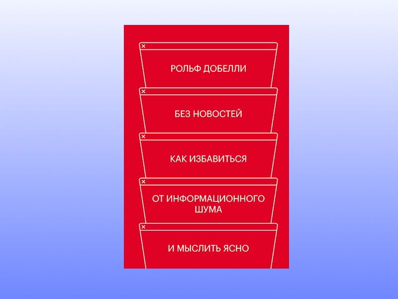

Рольф Добелли на протяжении всей книги довольно последовательно объясняет, 
почему он перестал читать новости и его жизнь стала лучше.


**Цитаты:**
> Лишь проглотив уже десятки тысяч новостей и потратив множество часов, я внезапно задал себе два вопроса.
> Во-первых: ты действительно лучше понимаешь окружающий мир?
> И во-вторых: ты теперь в самом деле принимаешь более правильные решения? 
> Ответ на оба вопроса: нет.

***
> Все, что подогревало интерес читателей и способствовало продажам газет,
> издатели воспринимали как «заслуживающее освещения в печати» – независимо от того, насколько оно важно.
> В этом фундаментальном обмане – подмене важного новым – ничего не изменилось по сей день.

***
> С годами у меня выработалось убеждение: важнее всего то, о чём не сообщается.

***
> А чем больше опилок вы засунете в свою голову, тем меньше там останется места для информации, которая по-настоящему нужна.

***
> Наша центральная нервная система выдает непропорционально сильную реакцию на яркие, скандальные, сенсационные, шокирующие,
> громогласные, плакатные, поляризованные, быстро меняющиеся, разноцветные раздражители и характеристики личности человека.
> А вот реакция на информацию абстрактную, многозначную, комплексную, сложную, медленно изменяющуюся, выстроенную в логические цепочки,
> не сразу понятную и нуждающуюся в объяснениях, непропорционально слаба.

***
> И производители новостей, и их потребители оказались во власти общего заблуждения: 
> перечисление фактов путают с выявлением причинно-следственных связей, определяющих принципы функционирования мира.

***
> Истинная свобода в том, чтобы не иметь мнения по некоторым вопросам.

***
> Что потребляет информация – ясно: она пожирает внимание получателей. 
> Избыток информации приводит к недостатку внимательности.

***
> Исследователи Кеп-Ки Ло и Риота Канаи 28 из Токийского университета установили такую особенность у любителей новостей:
> чем чаще человек потребляет информацию из разных источников,
> тем меньше мозговых клеток задействуется во фронтальной части поясной извилины,
> окружающей фронтальную часть мозолистого тела, – в том участке мозга, который отвечает, помимо прочего, за внимательность,
> размышления морально-нравственного порядка и самоконтроль.

***
> Мир новостей и ваша жизнь – как две разные вселенные, которые не соприкасаются.

***
> Avoid trifling conversation, «избегайте пустых разговоров», – так написано в одной из тринадцати максим (о молчании) Бенджамина Франклина.

***
> Если вы получаете новости бесплатно, то, вероятно, вы и есть конечный продукт.


***
**О книге:**

["Без новостей. Как избавиться от информационного шума и мыслить ясно" | Автор: Рольф Добелли](https://www.litres.ru/book/rolf-dobelli/bez-novostey-kak-izbavitsya-ot-informacionnogo-shuma-i-myslit-57350341/)
```
Цитаты из книги использованы в информационных и прочих целях в соответствии со статьёй 1274 ГК РФ.
Права на оригинальное произведение сохраняются за его автором/правообладателем
``` 