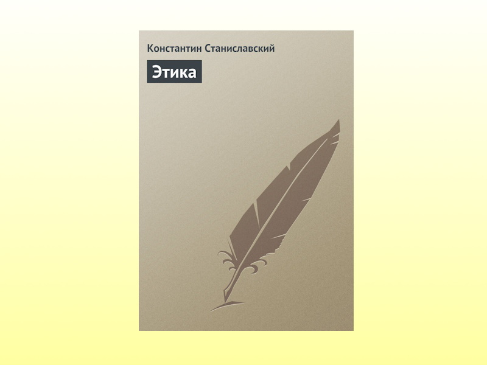

Станиславский предположительно начал работу над Этикой более ста лет назад, но вот некоторые принципы менеджмента по-прежнему актуальны.
Тут будет и DRY, и вопросы формальной и неформальной корпоративной культуры и общих контекстов, а также важность дисциплины
и личного примера руководителя для сотрудников.


**Цитаты:**
> Нельзя повторять одно и то же каждому в отдельности.

***
> Дело в том, что многие из них настолько несознательно относятся к своей работе, что следят на репетиции только за теми замечаниями,
> которые относятся непосредственно к их ролям. Те сцены и акты, в которых они не участвуют, остаются в полном небрежении.
> Не следует забывать, что всё касающееся не только роли, но и всей пьесы, должно быть принято в расчёт актёром, должно интересовать его.

***
> Толстой, Чехов и другие подлинные писатели считали до последней степени необходимым ежедневно, в определённое время, писать,
> если не роман, не повесть, не пьесу, то дневник, записывать свои мысли, наблюдения.
> Главное, чтобы рука с пером и рука на пишущей машинке не отвыкали ежедневно изощряться непосредственно в тончайшей и точнейшей передаче
> всех неуловимых изгибов мысли и чувства, воображения, зрительных видений и аффективных [эмоциональных] воспоминаний и пр.
> Спросите художника, он скажет вам решительно то же.

***
> Короче говоря здоровая атмосфера, дисциплина и этика не создаются распоряжением, правилом, циркуляром, росчерком пера.

***
> Когда вы требуете от других того, что сами уже провели в жизнь, вы уверены, что ваши требования выполнимы,
> вы по собственному опыту знаете, трудно оно или легко.

***
> Всё то, что вы хотели бы провести в жизнь, всё то, что нужно для водворения здоровой атмосферы, дисциплины и порядка (а это нужно знать),
> пропускайте прежде всего через себя.

***
> Собственный пример — самое лучшее доказательство не только для других, но главным образом для себя самого.

***
> Думайте побольше о других и поменьше о себе. Заботьтесь об общем настроении и общем деле, тогда и Вам будет хорошо.

***
> Пока выбор руководителя не сделан и назначение не состоялось можно спорить, бороться,
> протестовать против того или иного кандидата на руководящий пост; 
> но раз что данное лицо стало во главе дела или в управлении его частью, приходится,
> ради пользы дела и своей собственной всячески поддерживать руководителя и чем он слабее, тем больше нуждается в поддержке.


***
**О книге:**

["Этика" | Автор: Константин Станиславский](https://www.litres.ru/book/konstantin-sergeevich-stanislavskiy/etika-170237/)
```
Цитаты из книги использованы в информационных и прочих целях в соответствии со статьёй 1274 ГК РФ.
Права на оригинальное произведение сохраняются за его автором/правообладателем
``` 