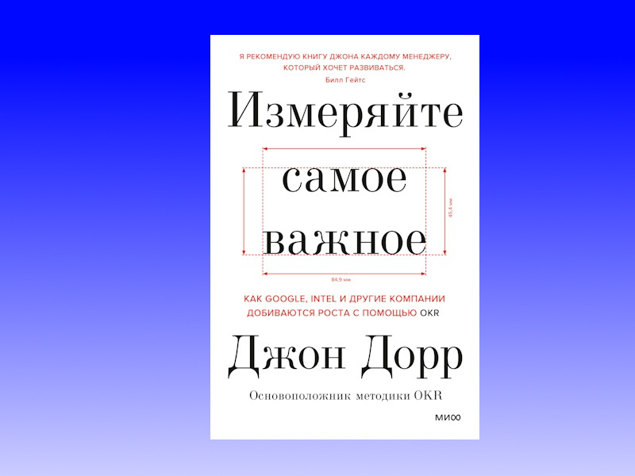

OKR — это Objectives and Key Results, а это в свою очередь еще один фреймворк для постановки целей, помимо SMART, MBO, NCT и других.
Вероятно, самая первая книга про OKR, представленная в переводе на русский язык. Основной момент в том, что в книге нет шагов по внедрению OKR в компании,
так что с этим придется повозиться самостоятельно.


**Цитаты:**
> Придумать идею легко. Главное — реализовать ее.

***
> Это не ключевой результат, если у него нет цифрового показателя.

***
> Но одно из его творений особо дорого моему сердцу: Билл привил критически важную соединительную ткань в систему OKR — фразу «оценивать по следующим критериям», или «О.С.К.».
> К примеру: «Мы добьемся цели; оценивать по следующим критериям: ключевые результаты…» Эти слова определенно внесли ясность.

***
> Когда СЕО говорит: «Все мои цели — командные цели», — это сигнал тревоги». 

***
> Чтобы обратная связь была эффективной, ее следует получить как можно скорее после выполнения задачи.

***
> Основная задача — сделать богатого человека еще богаче — лишена мотивации для генерального менеджера, не говоря уже об агенте команды на Восточном побережье или стажере PR-отдела,
> который пашет на ксероксе.

***
> Богу мы доверяем; все остальные должны предоставить фактические доказательства.

***
> Как заметил Питер Друкер: «Без плана действий управленец превращается в пленника событий. А без проверок для переосмысления плана действий по мере развития событий управленец не узнает,
> какие события действительно важны, а какие — пустая суета».

***
> Формулировать смелые цели не так сложно, как разбить их на этапы.


***
**О книге:**

["Измеряйте самое важное. Как Google, Intel и другие компании добиваются роста с помощью OKR" | Автор: Джон Дорр](https://www.litres.ru/book/dzhon-dorr/izmeryayte-samoe-vazhnoe-kak-google-intel-i-drugie-kompanii-dob-39473693/)
```
Цитаты из книги использованы в информационных и прочих целях в соответствии со статьёй 1274 ГК РФ.
Права на оригинальное произведение сохраняются за его автором/правообладателем
```