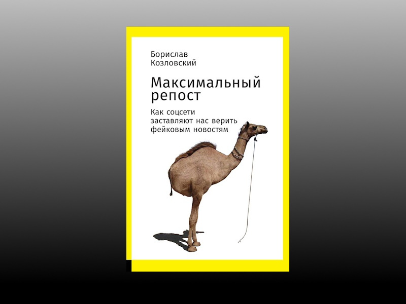

И, Боже вас сохрани, не читайте до обеда советских газет!


**Цитаты:**
> И вот почему: в сознании у читателя сталкиваются не один абзац новостной заметки с другим, равным ему по значимости,
> а сумма политических убеждений, накопленная за годы жизни, и какой-то конкретный факт, который разом ставит их под вопрос.

***
> Такую же связь нашли между верой в теории заговора и неуверенностью в будущем:
> чем ниже ваша социальная защищенность – тем выше доверие к теориям заговора. 

***
> Степень убежденности в заговоре зависит не от доказательной силы фактов, а от вашего психологического комфорта.

***
> Получается парадокс: если предоставить пользователям полную свободу доступа к информации – мы приложим максимум усилий,
> чтобы себя дезинформировать. 


***
**О книге:**

["Максимальный репост. Как соцсети заставляют нас верить фейковым новостям" | Автор: Борислав Козловский](https://www.litres.ru/book/borislav-kozlovskiy/maksimalnyy-repost-kak-socseti-zastavlyaut-nas-verit-36316575/)
```
Цитаты из книги использованы в информационных и прочих целях в соответствии со статьёй 1274 ГК РФ.
Права на оригинальное произведение сохраняются за его автором/правообладателем
``` 