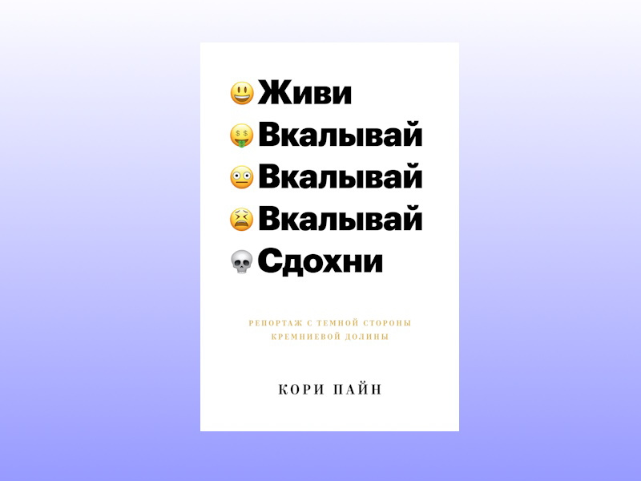

Как альтернативный вариант можно рассмотреть просмотр первых сезонов Силиконовой долины — будет повеселее.
А еще автор ошибся в третьей цитате — не за ноутбуком, а за телефоном.


**Цитаты:**
> Миллиардерство — вот, бесспорно, самая желанная карьера XXI века с многочисленными преимуществами перед таким востребованным видом занятости,
> как офисное рабство. А ее трудовые льготы ни с чем не сравнимы!

***
> Можете не сомневаться: единственный залог долгосрочного выживания в надвигающиеся тощие годы — располагать небывалым материальным благосостоянием.
> Всем будет наплевать, как вы получили свои деньги. С уровнем неравенства, достигшим исторических отметок, выбора вообще нет — либо ты миллиардер, либо пропал.

***
> Технологические гиганты растоптали все, что приносило в этом мире удовольствие. 
> Они не остановятся, пока абсолютно все не сведется к одной хрени: спине за ноутбуком.

***
> В чем был смысл подобных сборищ? В налаживании контактов, конечно. Получить работу получше, затем еще лучше,
> и так до тех пор, пока не заработаешь свои «да-пошел-ты-деньги», которые позволят наконец сказать: «Да пошел ты, босс, я ухожу».

***
> Обычно открытый только для сотрудников, Yelp Cafe имел идеальный пятизвездочный рейтинг… на самом Yelp. Как написал один комментатор,
> «по ходу, я вообще уже не покину офис!». Ну как бы да, — на то и расчет.

***
> Как сообщил счастливый жокей одного из единорогов техсайту Pando: «Все это сраная случайность. Нет никакой логики в том, как вас оценят».

***
> Чтобы сберечь деньги, большую часть еды я принялся готовить самостоятельно. Так я и понял, что запустить техстартап значительно проще,
> если можешь позволить себе всегда заказывать еду на дом и слыхом не слыхивать о стирке, мытье посуды,
> покупке продуктов и прочих повседневных заботах. Как заметил один остряк в твиттере, «техкультура 
> Сан-Франциско ищет ответ на один-единственный вопрос: что же моя мамочка больше за меня не делает?».

***
> Любой придурок с гуманитарным высшим образованием мог навешать лапши на уши и получить работу в маркетинге, но программистов надо было еще поискать.

***
> К тому же халява служила удобной ширмой для рабского офисного графика.

***
> Не ищи золото — продавай лопаты тем лохам, которые надеются разбогатеть в поисках золота.
> Сайрус поправил: «Вообще-то он сказал: „Заниматься интернет-маркетингом — все равно 
> что продавать крэк детям"». Впаривать наркотики звучало еще выгоднее, чем лопаты.

***
> Если 95 % стартапов потерпели крах, значит, 5 % привлекли все внимание как внутри отрасли, так и за ее пределами. Это означало,
> что медийный образ Кремниевой долины имел мало общего с реальностью. Я жил реальной жизнью.
> И в реальности практически все кругом были такими же лузерами, как я, изо всех сил пытавшимися проложить себе дорогу.

***
> «Мы сказали: „Ничего эта экономика не шерит, а снимает ответственность с работодателей и целиком перекладывает на плечи рабочих”».

***
> Помните, было когда-то такое слово, как скука? Из безделья рождались прекрасные вещи. Сегодня безделья нет.
> Все работают, даже когда уверяют себя, что у них перерыв. Говорят, что 
> «данные — это новая нефть». Но данные — это мы. Мы — новая нефть. И в отличие от нефти, мы возобновляемый ресурс.


***
**О книге:**

["Живи, вкалывай, сдохни. Репортаж с темной стороны Кремниевой долины" | Автор: Кори Пайн](https://www.litres.ru/book/kori-payn-21325975/zhivi-vkalyvay-sdohni-reportazh-s-temnoy-storony-kremni-68289203/)
```
Цитаты из книги использованы в информационных и прочих целях в соответствии со статьёй 1274 ГК РФ.
Права на оригинальное произведение сохраняются за его автором/правообладателем»
``` 